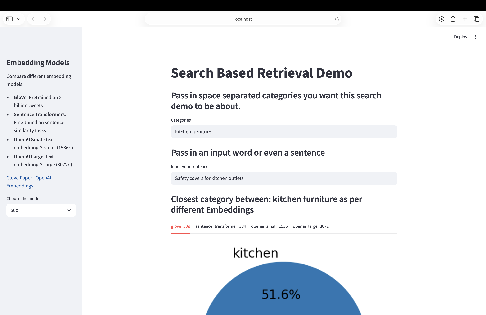
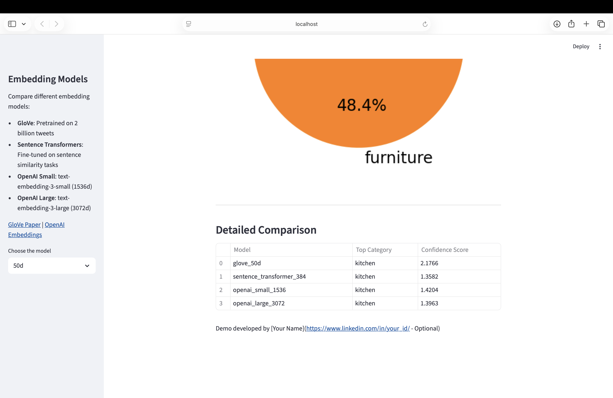

# Embedding Retrieval Demo

An interactive **Streamlit** demo for semantic retrieval / prototype classification.  
Given user-defined categories and an input sentence, the app converts both the sentence and each category into embeddings using multiple models, computes similarity scores, and visualizes the results.

## Features

- **Multi-model comparison**: Compare results from **GloVe 50d**, **SentenceTransformer 384d**, and **OpenAI text-embedding-3-small / text-embedding-3-large** on the same input.
- **Custom categories**: Users can enter arbitrary categories (space-separated) and instantly retrieve the closest category for the input text.
- **Similarity visualization**: Displays a pie chart of normalized similarity distribution across categories, plus a table summarizing each model’s **Top Category** and **Confidence Score**.
- **Lightweight retrieval logic**: Uses **cosine similarity** (with `exp(cos)` to ensure positive scores) to implement a minimal semantic retrieval / prototype classification pipeline.

## Quick Start
1. **Install dependencies:**

   ```bash
   pip install streamlit numpy sentence-transformers openai gdown matplotlib pandas
   ```
2. **Set OpenAI API Key:**

   ```bash
   export OPENAI_API_KEY="your-key-here"
   ```
3. **Run the app:**

   ```bash
   streamlit run miniproject_1.py
   ```

You should see a page like this in your local browser:



